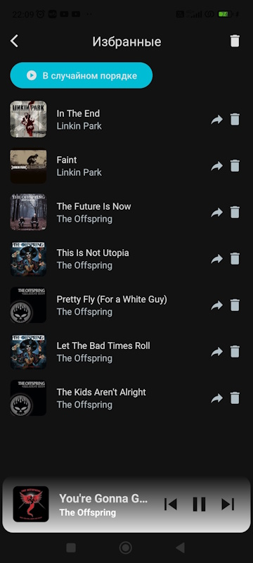
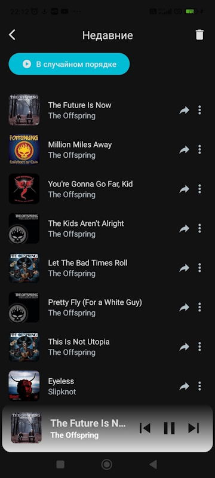
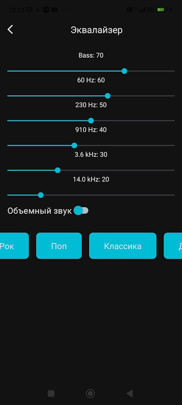
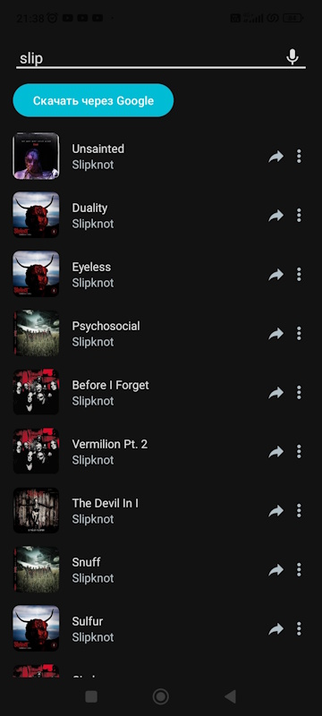

# Rhythm Wave

Rhythm Wave is an Android mobile application written in Kotlin that provides a user—friendly interface for listening to music with visualization. The app allows you to manage tracks, create playlists, adjust the equalizer, and more.

## Content

- [Description](#description)
- [Functions](#functions)
- [Technology](#technology)
- [Screenshots](#screenshots)
- [Contacts](#contacts)
- [License](#license)

## Description

Rhythm Wave is a music player for Android with music visualization. It provides the user with flexible frequency settings in the equalizer, convenient track management, and contains all the basic functions of a music player.

## Functions

- **Main screen:**
Contains three main fragments:
 - **Tracks:** A list of all tracks from the device.
 - **Albums:** A list of albums with the ability to navigate to a fragment of the track list in the album.
 - **Performers:** A list of artists with the ability to navigate to a fragment of the track list of the selected artist.
 - **Search:** Search for tracks by name in a separate fragment. If nothing was found, the user can click on the "Download via Google" button, after which the browser opens with a download request.

- **Visualization:**
An animation is drawn that displays the musical frequencies of the currently playing track 

- **Track management:**
 - Play, pause, rewind, switch tracks, play in random order.
 - Add to favorites, delete from favorites.
 - Adding to a playlist, deleting from a playlist.
 - Create and customize playlists (title and image).

- **Equalizer:**
- Frequency adjustment.
 - Presets for various

## Technology

- **Programming language:** Kotlin
- **Platform:** Android
- **Libraries:** AndroidX, ExoPlayer, Room
- **Tools:** Android Studio, Gradle

## Screenshots

## Contacts

If you have any questions or suggestions, please contact me.:

- **Email:** dev.assist@yandex.ru
- **GitHub:** [S0s0Combain](https://github.com/S0s0Combain)

## License

This project is licensed under the [MIT License](LICENSE).
